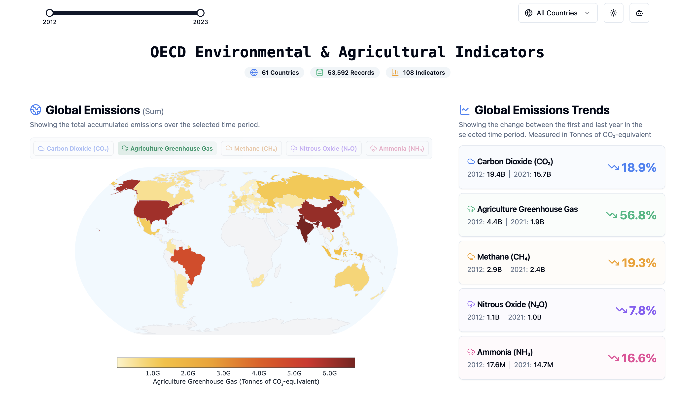
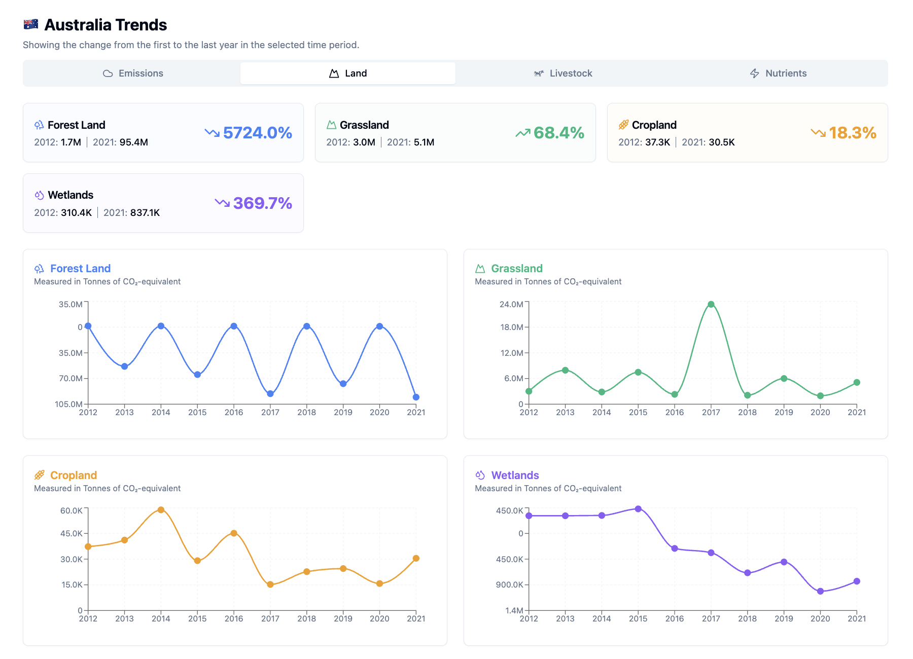
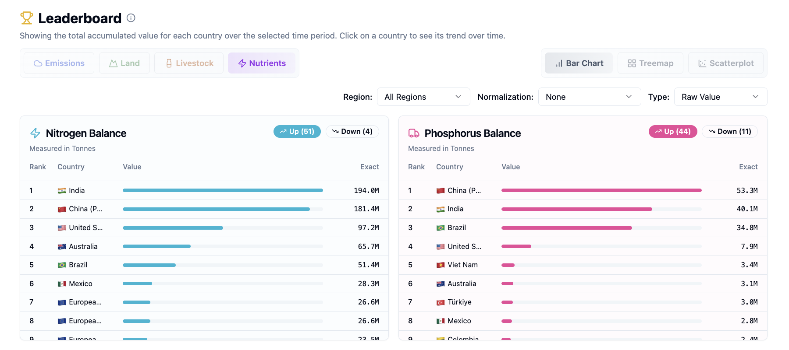
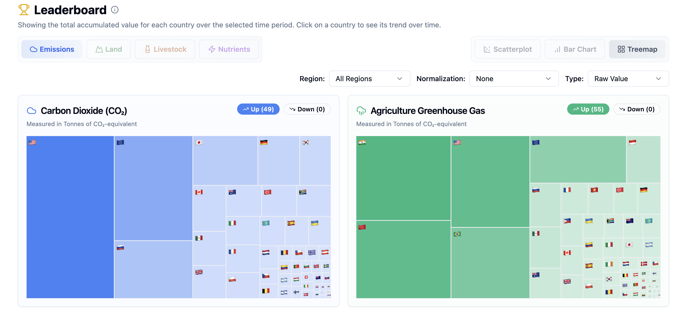
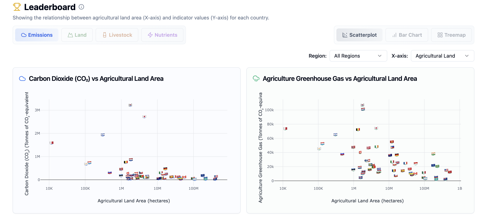
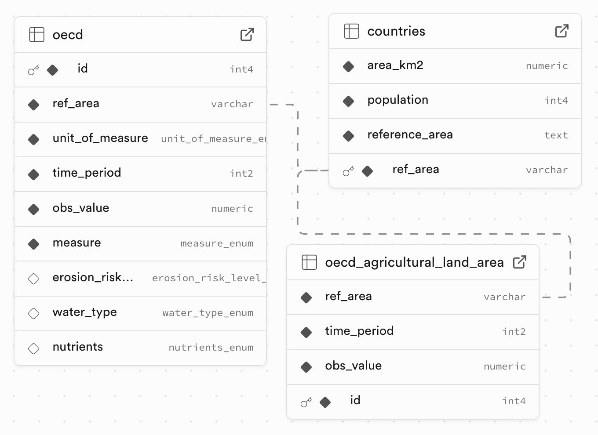

<!-- markdownlint-disable MD013 MD033 -->
<h1 align="center">🌍 OECD Environmental & Agricultural Indicators Dashboard</h1>

  <strong>Explore over a decade of environmental, agricultural &amp; livestock data for every OECD member country – all in one interactive place.</strong>

  
  

---

## 📜 Table of Contents

- [Features](#-features)
- [Screenshots](#-screenshots)
- [Tech&nbsp;Stack](#-tech-stack)
- [Project&nbsp;Structure](#-project-structure)
- [Components](#-components)

## ✨ Features

- **Rich interactive visualisations** – leverages Plotly.js, Recharts and custom D3-powered components for maps, treemaps, scatterplots and trend charts.
- **Drill-down analytics** – quickly switch between global view and country-specific insights.
- **Dynamic leaderboards** – rank countries by raw values, total growth, average yearly growth, growth rate and more.
- **Flexible normalisation** – view absolute indicator values or normalise by population, land area, density or agricultural land.
- **Year range & region filters** – focus on any time slice or geographical region.

## 📸 Screenshots

**Global Emissions.** Quick insights into emissions of CO₂, GHG, CH₄, N₂O and NH₃ globally.

<figure>
  
</figure>

 

**Country Trends.** Shows trends across various metrics for a particular country.

<figure>
  
</figure>

 

**Leaderboard – Horizontal Bar Chart.** Ranks all OECD members across various metrics, with options for normalization and growth metrics.

<figure>
  
</figure>

 

**Leaderboard – Treemap.** Visualises each country’s contribution to the OECD total, emphasising relative magnitude.

<figure>
  
</figure>

 

**Leaderboard – Scatter Plot.** Explores bivariate relationships (e.g., emissions vs. population) to identify patterns and outliers.

<figure>
  
</figure>

## 📦 Tech Stack

- **Next.js 15** – React 19, App Router, Server Actions ready.
- **TypeScript** – static type-safety.
- **Supabase** – hosted PostgresSQL.
- **Plotly.js / react-plotly.js** – heavy-duty interactive charts.
- **Recharts** – lightweight composable charts.
- **Radix UI + shadcn** – accessible unstyled primitives & beautiful components.
- **Tailwind CSS** – utility-first styling.
- **Lucide React & React-Icons** – iconography.

## 🗄️ Database Schema

<figure>
  
  <figcaption align="center">Database Entity-Relationship Diagram</figcaption>
</figure>

### Table `countries`

| Column           | Type    | Description                                  |
| ---------------- | ------- | -------------------------------------------- |
| `ref_area`       | varchar | ISO-3166 alpha-3 country code (primary key). |
| `population`     | integer | Total resident population (persons).         |
| `area_km2`       | numeric | Land area in square kilometres.              |
| `reference_area` | text    | Human-readable country or territory name.    |

### Table `oecd`

| Column               | Type                    | Description                                                            |
| -------------------- | ----------------------- | ---------------------------------------------------------------------- |
| `id`                 | serial                  | Surrogate primary key for the fact table.                              |
| `ref_area`           | varchar(10)             | Foreign key linking to `countries.ref_area`.                           |
| `measure`            | measure_enum            | Indicator measured                                                     |
| `erosion_risk_level` | erosion_risk_level_enum | Soil-erosion risk category for land-quality measures.                  |
| `water_type`         | water_type_enum         | Water body classification for water-quality measures.                  |
| `nutrients`          | nutrients_enum          | Nutrient type (e.g., `nitrogen`, `phosphorus`) for run-off indicators. |
| `unit_of_measure`    | unit_of_measure_enum    | Unit in which the observation is recorded.                             |
| `time_period`        | smallint                | Calendar year of the observation.                                      |
| `obs_value`          | numeric(15,2)           | Observed value.                                                        |

### Table `oecd_agricultural_land_area`

| Column        | Type          | Description                           |
| ------------- | ------------- | ------------------------------------- |
| `id`          | serial        | Surrogate primary key.                |
| `ref_area`    | varchar(10)   | Foreign key to `countries.ref_area`.  |
| `time_period` | smallint      | Calendar year.                        |
| `obs_value`   | numeric(15,2) | Agricultural land area (thousand ha). |

## 🗂️ Project Structure

| Path          | Purpose                                                                                                                   |
| ------------- | ------------------------------------------------------------------------------------------------------------------------- |
| `app/`        | Next.js **App Router** pages – top-level layout and root route rendering the dashboard component.                         |
| `components/` | Reusable UI and chart components. Sub-folder `ui/` contains Radix-based primitives styled with Tailwind.                  |
| `hooks/`      | React hooks for data fetching (`use-dashboard-data`, `use-country-data`, etc.) and utilities (`use-mobile`, `use-toast`). |
| `lib/`        | Client-side libraries – currently just the Supabase client + generic helpers.                                             |
| `utils/`      | Pure utility functions (regions, number formatters, colour scales, etc.).                                                 |
| `styles/`     | Global Tailwind CSS imports.                                                                                              |
| `public/`     | Static assets such as images, icons and og-tags.                                                                          |

## 🧩 Components

| Component                              | Purpose                                                                                                                  |
| -------------------------------------- | ------------------------------------------------------------------------------------------------------------------------ |
| **World Map (Choropleth)**             | Spatially compares normalised indicator values across all OECD members to highlight geographic hot-spots and outliers.   |
| **Global Emissions Chart (KPI Cards)** | Presents multi-gas emission KPIs with absolute values and percentage deltas, enabling rapid high-level trend assessment. |
| **Country Trends**                     | Time-series line/area chart for a single country – supports comparing multiple indicators and annotating regime changes. |
| **Leaderboard Bar Chart**              | Ranks countries on absolute or per-capita values; ideal for Pareto assessment and top-N analyses.                        |
| **Leaderboard Treemap**                | Visualises proportional contribution of each country to the OECD aggregate, aiding share-of-total reasoning.             |
| **Leaderboard Scatter Plot**           | Explores bivariate relationships (e.g., emissions vs. intensity) uncovering clusters, correlations and outliers.         |
| **Dashboard Filters & Selectors**      | Provides faceting by measurement domain, normalisation basis, region, and year range for robust subgroup analysis.       |
